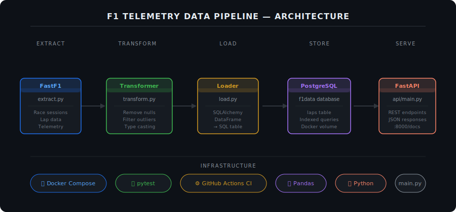

# F1 Telemetry Data Pipeline

A production-style data engineering pipeline that extracts real Formula 1 session data, transforms and analyses it, stores it in PostgreSQL, and serves it through a REST API. Built to demonstrate data engineering fundamentals directly applicable to F1 software and telemetry roles.

---

## Architecture



---

## Tech Stack

| Layer | Technology |
|-------|-----------|
| Data extraction | FastF1, Python |
| Transformation | Pandas, NumPy |
| Storage | PostgreSQL |
| API | FastAPI |
| Containerisation | Docker, Docker Compose |
| Testing | pytest |
| CI/CD | GitHub Actions |

---

## What It Does

1. **Extracts** real lap data from a Formula 1 race session using FastF1
2. **Transforms** raw data — removes null laps, filters outliers, converts timedelta to seconds, enforces correct data types
3. **Loads** clean data into a PostgreSQL database
4. **Serves** the data through a REST API with endpoints for driver laps, fastest laps, and tyre compound analysis

---

## Challenges Solved

- Resolved port conflicts between host PostgreSQL service and Docker containers by stopping the native Ubuntu service and resetting volumes
- Fixed cross-container communication failures by configuring a custom Docker bridge network across all services
- Handled FastAPI JSON serialisation errors caused by NaN and infinite float values in FastF1 telemetry by replacing out-of-range values with None

---

## API Endpoints

| Endpoint | Description |
|----------|-------------|
| GET / | Health check |
| GET /laps | All laps |
| GET /laps/{driver} | All laps for a specific driver |
| GET /laps/{driver}/best | Fastest lap for a specific driver |
| GET /fastest-lap | Fastest lap across all drivers |
| GET /compounds | Average and fastest lap time per tyre compound |

---

## How to Run

**Requirements:** Docker and Docker Compose installed

```bash
git clone [https://github.com/YOUR_USERNAME/YOUR_REPO.git](https://github.com/YOUR_USERNAME/YOUR_REPO.git)
cd f1-pipeline
docker compose up --build